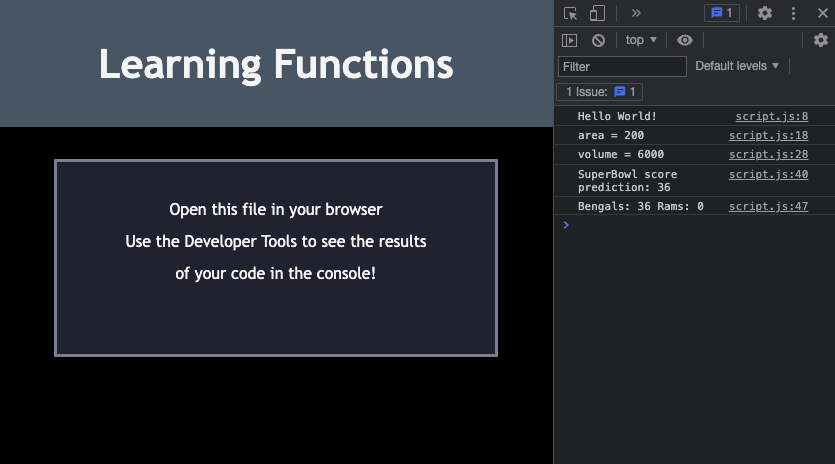

# 🏗️ Practice Writing Functions

Work with your breakout group to implement the following user stories:

1. As a developer, I want to write (and call) a function that logs `'Hello World!'` to the console.

2. As a developer, I want to write a function that accepts two parameters of `length` and `width`, and returns the `product`, which equals the `area`.

3. As a developer, I want to write a function that accepts three parameters of `length`, `width` and `height`, and returns the `product`, which equals the `volume`.

4. As a developer, I want to write a function to predict the score of the Super Bowl game. This function should take in four parameters of `touchdown, extra point, two point conversion` and `field goal`, and return the total of all four parameters.

## Acceptance Criteria

1. It's done when `'Hello World!'` is logged to the console

2. It's done when the function takes `parameters` of `10` and `20`, and returns `200` as the area.

3. It's done when the function takes `parameters` of `10, 20,` and `30`, and returns `6000` as the volume.

4. It's done when the function takes `parameters` of `3, 3, 0, 5` and returns `36`

### 🏆 Bonus

* Use the Super Bowl Score function to predict the score for each team, and console log a Final Score prediction.

## Screenshot of Console when Solved

## 💡 Hints

Use [Google](https://www.google.com) or another search engine to research this.

If you have completed this activity, work through the following challenge with your group to further your knowledge:

* What is hoisting?

* What's the difference between a function declaration, a function expression, and an arrow function?

* Try writing each function in the 3 different formats (function declaration, a function expression, and an arrow function)

---
